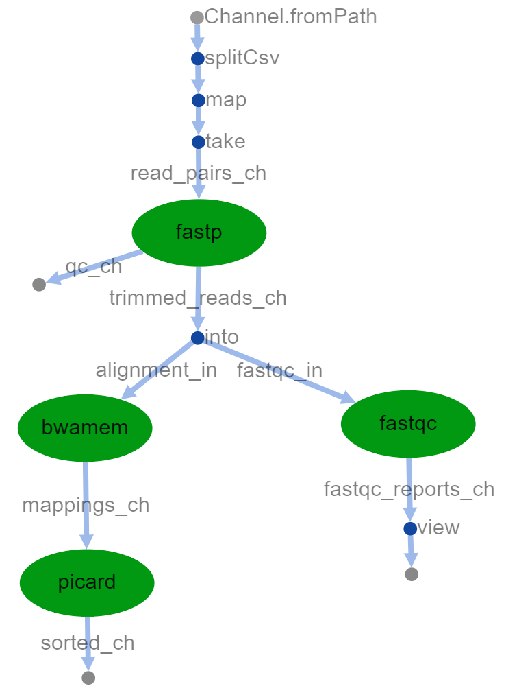

# John Zinno 
## NGS Final - Nextflow

### **Basic running of the pipeline**

Copy this directory to where you would like to work on Greene. 

Use the command `sbatch master-nf.sh` to start running the pipeline 

The results are published to the created directory here in `output/`. The final sorted `bam` files will appear in the directory `output/sorted/` with the expected names: `NA18591_sorted.bam`, `NA18627_sorted.bam`, `NA18757_sorted.bam`. Upon completion the files `report-nextflow-log.html`, `timeline.html`, and `flowchart.html` are produced and contain information on how the pipeline ran. 

### **How it works**

First, a sample manifest in a three column `tsv` format of the type `sampleID read1 read2` is parsed into the `read_pairs_ch` channel. Each sample is then processed with `fastp` and the outputs are temporarily  held in the `trimmed_reads_ch` channel, and trimmed read files are published to the `output/trimmed_reads` directory. This `trimmed_reads_ch` channel is then split into the `alignment_in` channel and `fastqc_in` channel. The `fastqc_in` channel is then consumed to produce quality control reports for each sample. Simultaneously, the `alignment_in` channel is consumed for mapping of the reads to the reference genome via `bwamem`. The `bwamem` ouput `sam` and `bam` files are then published to the `output/aligned` directory and the `bam` files held in the `mappings_ch` channel. The `mappings_ch` channel is then consumed by `picard` for coordinate sorting of the aligned reads. The coordinate sorted `bam` files and thier index `bai` files are then published to the `output/sorted` directory. The workflow is now complete.

This pipeline was built to specifically address the final project tasks. For this reason there are a few modifications to the data importing that are what I would consider non-standard for general use. The two major things to note are first that the manifest table defining read pairs per sample lacked the full path to the `fastq` files and instead only listed the file names. To address this, a parameter `params.datadir` was defined in the `nextflow.config` file that contained that path to the directory contianing data files: `/scratch/work/courses/BI7653/hw2.2022/`. Additionally, we are asked to only process the first three samples in the manifest. In order to only process those first three samples, when reading in the data I use the operator `.take(3)` in order to select the first three samples.  

